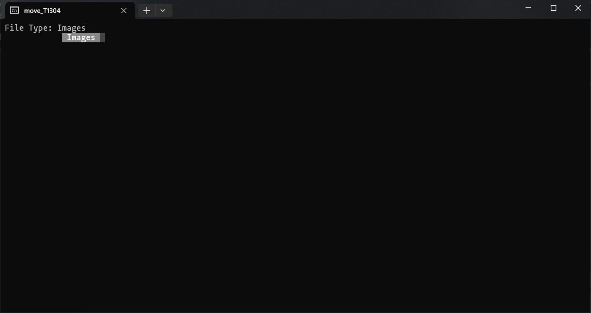

.png)

# improved-barnacle

cleanup Python script.  
The project cleans the download folder moving files to respective folders based on extensions. 

[](https://img.shields.io/github/v/release/charudatta10/improved-barnacle?include_prereleases)
[](https://img.shields.io/github/last-commit/charudatta10/improved-barnacle)
[](https://img.shields.io/github/issues-raw/charudatta10/improved-barnacle)
[](https://img.shields.io/github/issues-pr/charudatta10/improved-barnacle)
[](https://img.shields.io/github/license/charudatta10/ideal-octo-engine)

 <!---
# Table of Contents

This is a table of contents for your project. It helps the reader navigate through the README quickly.
- [improved barnacle](#improved-barnacle)
- [Quick Start Demo](#quick-start-demo)
- [Table of Contents](#table-of-contents)
- [Installation](#installation)
- [Usage](#usage)
- [Development](#development)
- [Contribute](#contribute)
- [License](#license)
--->
# Installation

1. To install from binaries:  
   Download the binary file from the release and double-click to use it.

2. To install from source:

```PowerShell
gh repo clone charudatta10/improved-barnacle
```
 
# Usage



# Support

create a pull request for support. 

# Authors and Contribution guidelines

The author of this project is @charudatta10.  
The contribution to this project should adhere to GPL-3.0 and respect the copyright claims of charudatta10.

# License

Copyright © 2024 charudatta10.   
The project is licensed [GPL-3.0](LICENSE).


